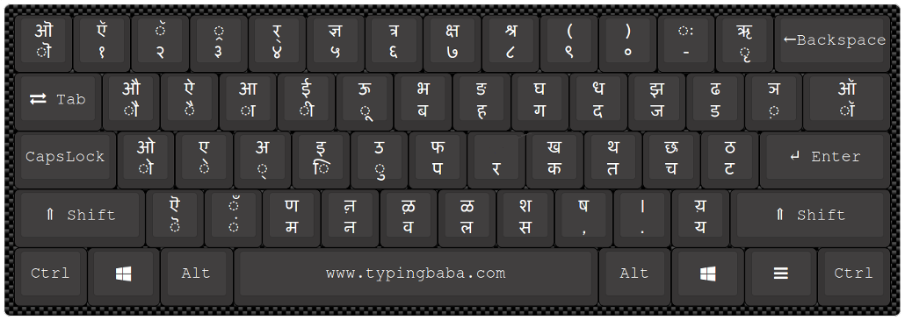

# decolonizing_bharatiya_keyboards

## Why this Repo
Most people (more than 95%) type Bhartiya languages using transliteration. There are many disadvantages of typing using transliteration compared to direct typing using inscript keyboard. This repo is for comparision between transliteration and InScript method of typing.  
This repo calculates the average number of __keystrokes__ required to accurately type the given text of Indian Languages.     

### Flaws of Transliteration: 
1. We first convert a word from our native script to Roman equivalent and then transliterator converts it back into Bhartiya Scripts.
2. Transliterators are not 100% accuracte. In fact, it becomes highly inacurate when we use uncommon words.
3. Some words just cannnot be written with transliteration. Try writing our national song : 'Vande Mataram' using it. We can only write words which are in the training dataset of some tech company. We cannot create new vocabulary in our languages. In addition, we cannot share words among Bhartiya Bhashas, e.g. I cannot write word 'आत्मोचित'(meaning Appropiate for Atma and which is proper word is Hindi and Samskrit) - in Gujarati Script using Microsoft Window's transliteration.    
4. We also make mistakes in mental conversion of native script to roman script. 
5. We need to use more keystrokes to write same word. Ex. To write चिराग using Inscript Keyboard, I need 5 keystrokes (च,ि,र,ा,ग). Transliteration would require   6 keystrokes (c,h,i,r,a,g). 
6. This method of Input is not entierly free. It is free only as long as you are on specific platform. The platform company has other ways of making money while you are on their platform. For example:   
    * Microsoft provides transliteration service free as long as you are using Windows. But Microsoft charges upfront to let us install Windows. If we want to use it outside the windows, then we would be required to use their __paid__ API : https://azure.microsoft.com/en-in/pricing/details/cognitive-services/translator/  
      As of now it will cost us ₹815 per 1 million character. The 167 line document that I have uploaded would cost us around ₹18 to type.    
   
    * Similarly, Google's transliteration, __Google Input Tools__ https://www.google.com/inputtools/try works only within Google's platforms and Google Apps. Each character we type on these apps/platforms goes to Google's servers. Google knows how to make money using our data.  
        Until few years ago, Google used to give their Input Tools as a __free__ standalone application on Windows. Google has stopped the windows app as it no longer suits their business model (or they have collected enought data, why give it free now). You need to use __Chrome__ if you want to type using Google Input Tools. Again, Chrome is a commercial product.    
7. We will get inconsistent typing experince if we switch platforms. e.g. As of now(11/02/2023): For character sequence  __'j a n'__, Microsoft gives __"જન (जन)"__ as a first prediction, where as Google Input Tools gives __'જાણ (जाण)'__. Once we get used to typing with specific platform, it will act as a deterrent to our wish to switch platform.
8. The platform companies are pushing transliteration instead of giving hardware solutions because they wants us to get addicted to the their platform's transliteration. They can make money as long as we are on their platform.     

### What is the solution?
If we start using direct typing using __Inscript Keyboards__ then we would not face any of the issue.

### What is Inscript Keyboard:
* InScript (short for Indic Script) is the __decreed standard keyboard layout__ for Indian scripts using a standard 104- or 105-key layout.   
* This keyboard layout was __standardised__ by the __Government of India__ for inputting text in languages of India written in Brahmic scripts, as well as the Santali language, written in the non-Brahmic Ol Chiki script.  
* It was developed by the Indian Government and supported by several public and private organisations. 
* This is the __standard keyboard for 12 Indian scripts__ including Devanagari, Bengali, Gujarati, Gurmukhi, Kannada, Malayalam, Odia, Tamil and Telugu, among others. 
* The InScript layout is built into most of the major operating systems including __Windows (2000 and later), and most Linux and Mac OS systems.__

The InScript keyboard layout looks like below:

### Advantages of Inscript
1. It requires less key strokes compared to transliteration.
2. It is 100% accurate. It is direct typing method. It will type what you want. It can type our __national song__ easily.
3. Inscript is designed specifically for Bharatiya languages. Indian Languages follow consonent-vowel sequence. Left side of keyboard has Swaras and right side has Vyanjanas. Therefore, we can type faster with alternate hand action.
   
4. The position of alphabets is same across all the Indian languages. Therefore,  if one learn to type in Telugu, s/he can type in Marathi also.
5. It is very easy to learn as it uses inherent logic of Bharatiya alphabets.  
      For Example, look at the below image :
      
      * Consonents are arranged in verticle postion as per their Varga (वर्ग) as shown using red line. प Varg = (प,फ,ब,भ), क Varg = (क,ख,ग,घ), त Varg = (त,थ,द,ध), च Varg = (च,छ,ज,झ), ट Varg = (ट,ठ,ड,ढ).
      * महाप्राण (aspirated) consonents are positioned in the shifted position of their corresponding अल्पप्राण (non-aspirated) consonents. e.g. (क,ख), (प,फ), and  (स,श) etc.       
      * Short and long vowel signs (चिह्व) are arranged in verticle position as shown in __blue__ line.  e.g. (्,ा),(ि,ी), (ु,ू),(े,ै) and (ो,औ).
      * The Vowel character is located in shifted position of their corresponding sign. e.g. (्,अ), (ा,आ), (ि,इ), (ी,ई), (ु,उ), (ू,ऊ), (े,ए), (ै,ऐ), and (ो,ओ)  (ौ,औ).
6. Less mental effort as it is no longer required to convert every word into roman script in mind.

### Results:
In my testing with Gujarati, transliteration required 23% more keystrokes.  

Typing time and number of keystrokes are highly correlated. Therefore, we can conclude that typing with transliteration requires 23% more time.

### Question : 
Why we don't have Bharatiya alphabets on keyboards? 
Rest of the world have it. The image shown above is Thai Magic Keyboard from Apple.

### TODO 
1. Mesaure the accuracy of Microsoft Transliteration.
2. Calculate the character frequency of Indic characters: unigram and bigram
